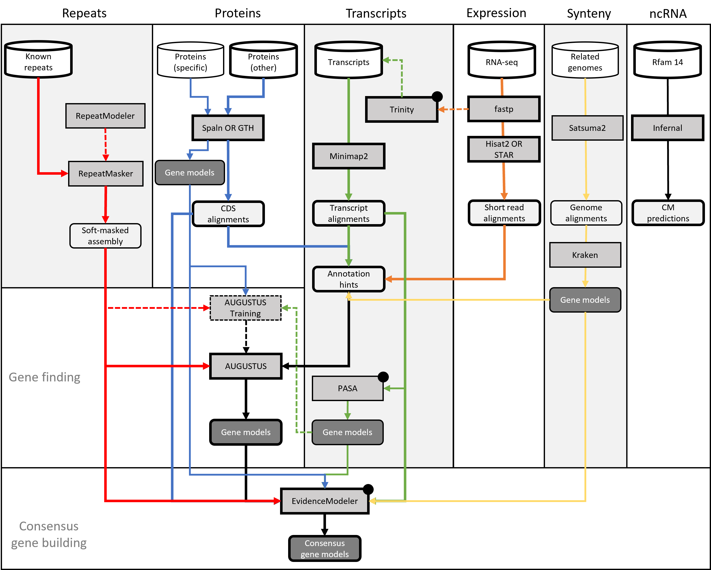

# nf-core/genomeannotator: Usage

## :warning: Please read this documentation on the nf-core website: [https://nf-co.re/genomeannotator/usage](https://nf-co.re/genomeannotator/usage)

> _Documentation of pipeline parameters is generated automatically from the pipeline schema and can no longer be found in markdown files._

## Introduction

nf-core/genomeannotator is a pipeline for the annotation of metazoan genomes. While nothing within the pipelines makes it particularily specific to this taxonomic group, it has only been tested (and developed) for this purpose. nf-core/genomeannotator combines a number of 
established tools for the assembly, alignment and subsequent integration of so-called evidences into consensus gene builds. The product of nf-core/genomeannotator are various tracks in GFF format, including gene models, but also various alignments. Output from nf-core/genomeannotator is
largely compatible with GMOD.

Included in nf-core/genomeannotator are:
- Protein alignments with SPALN
- Transcript alignments with Minimap2
- RNAseq alignments with STAR
- De-novo transcriptome assembly (genome-guided) with Trinity
- Ab-initio gene finding with AUGUSTUS
- Gene building from transcripts using PASA
- Consensus gene building using EvidenceModeler
- ncRNA predictions using RFam/Infernal
- Synteny alignments and annotation projection using Satsuma2 and Kraken
- Various scripts to transform in- and outputs between the above steps



## Recommended strategy

A typical annotation run will use tens of thousands of transcripts and/or tens of millions of paired-end RNAseq reads as well as tens of thousands of proteins. Sources to obtain such data include [Uniprot](www.uniprot.org), [SRA](https://www.ncbi.nlm.nih.gov/sra) or [ENA](https://www.ebi.ac.uk/ena/browser/).

If available, adding related genomes and their reference annotations can help to further improve the resulting gene builds. We have had good experiences using [EnsEMBL](https://ftp.ensembl.org/pub/) as a source for this type of data.

Finally, nf-core/genomeannotator will perform a mandatory repeat masking of the assembly. Consider providing a  comprehensive library of known repeats to speed up this process (else, see below): 

## Limitations

Automatic gene building produces draft annotations. Adding more data can help increase the overall quality, but in the end manual curation should be performed to achieve optimal results. Typical issues include false-positive models, 
split models or missing models. The extend to which these three problems occurs depends on several factors, starting with the availability of sufficient evidence data as well as a suitable prediction model in AUGUSTUS. 

## Assembly

The assembly refers to the genome you want to annotate. This file must be in FASTA format. Additionally, we recommend you clean the fasta headers in a way so they do not contain any special characters, unnecessary spaces or other "meta" data. While nf-core/genomeannotator
will try to sanitize the FASTA headers as well, it's generally better to take care of that beforehand so there are no surprises afterwards. 

Please also be aware that some public databases do not allow the submission of assemblies that have leading or trailing 'N's in any of their scaffolds.

Finally, note that nf-core/genomeannotator is not designed for the annotation of incomplete and/or highly fragmented assemblies. While such inputs may still work, some of the alignment heuristics will potentially perform poorly or fail entirely, i.e. crash the pipeline. As
a rule of thumb, your BUSCO scores should be above 80% and the number of contigs not exceed "a few thousand". There is no strict limit on the size of your assembly, but we have only tested nf-core/genomeannotator with genomes up to 'human-size', i.e. 3Gb. Much larger genomes
may cause unforseen issues. If so, please open a ticket on github and we can try to find a solution. 

```console
--assembly '[path to assembly.fasta]'
```

## Evidence(s)

The pipeline requires one of several types of annotation evidences to guide the gene finding process. Valid options are:

| Type                | Option                 | Description                                                           |
|---------------------|------------------------|-----------------------------------------------------------------------|
| Proteins            | `--proteins`           | A file with proteins in FASTA format from related organisms.          |
| Proteins (specific) | `--proteins_targeted`  | A file with proteins in FASTA format from this organism.              |
| Transcripts         | `--transcripts`        | A file with transcripts/ESTs in FASTA format from this organism.      |
| RNAseq reads        | `--rnaseq_samples`     | A samplesheet pointing at available RNAseqs reads from this organism. |  
| Related genomes     | `--references`         | A list of genomes in FASTA format with matching GTF annotation files. |

## Repeatmasking

Repeatmasking provides important information for the ab-initio prediction of gene models - it is thus a mandatory step in nf-core/genomeannotator. Repeatmasking can be triggered in three ways. The preferred option is to provide a set of known repeats from public databases
in FASTA format (--rm_lib). Alternatively, nf-core/genomeannotator can run the DFam database built into RepeatMasker (--rm_species). If neither option is specified, repeats are modeled de-novo. This can take 24 hours or more, depending on the size of your genomes. Please
be aware that assemblies based on short reads tend to perform poorly in this as repeats are often collapsed by the assembly software. 

## FASTA inputs

Several inputs to this pipeline are expected in FASTA format  (see table above). Note that the pipeline expects ONE file per input option. If you have multiple files of e.g. proteins, please concatenate them first and make sure no IDs are duplicated. 

Similar to the assembly, the sequence identifies should be sparse, i.e.should not contain spaces, colons, semicolons or any other form of decoration beyond the basic, unique identifier. nf-core/genomeannotator will remove any characters from the identifier past the 
first empty space. 

## RNAseq samplesheet input

If you want to include RNAseq raw reads, you will need to create a samplesheet with information about the input data. Use this parameter to specify its location. It has to be a comma-separated file with 4 columns, and a header row as shown in the 
example below.

```console
--rnaseq_samples '[path to samplesheet file]'
```

The format should be as follows:

```console
sample,fastq_1,fastq_2,strandedness
SAMPLE1,AEG588A1_S1_L002_R1_001.fastq.gz,AEG588A1_S1_L002_R2_001.fastq.gz,forward
SAMPLE2,AEG588A2_S2_L002_R1_001.fastq.gz,AEG588A2_S2_L002_R2_001.fastq.gz,forward
```

| Column         | Description                                                                                                                                                                            |
|----------------|----------------------------------------------------------------------------------------------------------------------------------------------------------------------------------------|
| `sample`       | Custom sample name. This entry will be identical for multiple sequencing libraries/runs from the same sample. Spaces in sample names are automatically converted to underscores (`_`). |
| `fastq_1`      | Full path to FastQ file for Illumina short reads 1. File has to be gzipped and have the extension ".fastq.gz" or ".fq.gz".                                                             |
| `fastq_2`      | Full path to FastQ file for Illumina short reads 2. File has to be gzipped and have the extension ".fastq.gz" or ".fq.gz".                                                             |
| `strandedness` | The orientation the reads were sequenced in. Typically, this will be `forward` as per the Illumina TruSeq library kit (dUTP)                                                           |

If at all possible, you should use poly-A selected, stranded mRNA-seq data for this with a read configuration of 2x150bp. It is not necessary (or recommended) to use biological replicates! Instead, rather try adding several developmental stages and tissues. 

## Reference genome alignments

nf-core/genomeannotator can align your assembly to one or more related reference genomes to lift their existing annotations and use this information during gene building. We have tested this primarily with assemblies and annotations from [EnsEMBL](https://ftp.ensembl.org/pub/), but other sources
may work too. Note that the annotation must be in GTF format! To pass this data to nf-core/genomeannotator, a sample sheet is needed.

The format should be as follows:

```console
species,fasta,gtf
Human,/path/to/human.fasta,/path/to/human.gtf
```

| Column         | Description                                                                                                                                                                            |
|----------------|----------------------------------------------------------------------------------------------------------------------------------------------------------------------------------------|
| `species`      | Name of the species as a single string (i.e. should not include spaces or special characters                                                                                           |
| `fasta `       | The genome sequence in FASTA format.                                                                                                                                                   |
| `gtf`          | The matching annotation in GTF format.                                                                                                                                                 |

Please beware that trying to align larger genomes and/or highly fragmented genomes can take a significant amount of computing time (i.e. days!). In extreme cases, jobs may exceed available walltime. If possible, limit the number of genomes
you align to only a handful (1-3) and prefer genomes with very high contiguity (ideally chromosome-level assembly). 

## Evaluating results

Gene builds can be evaluated in two ways - by gauging completeness against a reference data set and by simple visual inspection. 

[BUSCO](https://busco.ezlab.org/) can be used to check how many genes specific to a particular taxonomic group were found in a respective annotation set. To enable this metric, run nf-core/genomeannotator with `--busco_lineage xxx_odb10`, where `xxx` represents 
a taxonomic group available through BUSCO (see parameter options). 

Visual inspection requires for the annotation(s) and supporting alignment tracks to be loaded into a genome browser. This could be something like [IGV](https://software.broadinstitute.org/software/igv/) as a stand-alone option on your personal computer, or
a community curation platform such as [WebApollo](http://genomearchitect.org/). This process will reveal key issues with your gene build, such as fragmented models caused by inadequate input data or other challenges related to the data. 

WebApollo in particular is a key component to polishing your automated gene builds for scientific downstream uses. 

## Running the pipeline

The typical command for running the pipeline is as follows:

```console
nextflow run nf-core/genomeannotator --assembly my_asembly.fa --proteins proteins.fa --transcripts ESTs.fa --rnaseq_samples samplesheet.csv -profile docker
```

This will launch the pipeline with the `docker` configuration profile. See below for more information about profiles.

However, considering the vast number of available parameters, we recommend you use a YAML file as input. We have included an example with the pipeline [here](https://github.com/nf-core/genomeannotator/blob/master/assets/config.yaml).

```console
nextflow run nf-core/genomeannotator -params-file config.yml -profile docker
``` 

Note that the pipeline will create the following files in your working directory:

```console
work            # Directory containing the nextflow working files
results         # Finished results (configurable, see below)
.nextflow_log   # Log file from Nextflow
# Other nextflow hidden files, eg. history of pipeline runs and old logs.
```

### Updating the pipeline

When you run the above command, Nextflow automatically pulls the pipeline code from GitHub and stores it as a cached version. When running the pipeline after this, it will always use the cached version if available - even if the pipeline has been updated since. To make sure that you're running the latest version of the pipeline, make sure that you regularly update the cached version of the pipeline:

```console
nextflow pull nf-core/genomeannotator
```

### Reproducibility

It is a good idea to specify a pipeline version when running the pipeline on your data. This ensures that a specific version of the pipeline code and software are used when you run your pipeline. If you keep using the same tag, you'll be running the same version of the pipeline, even if there have been changes to the code since.

First, go to the [nf-core/genomeannotator releases page](https://github.com/nf-core/genomeannotator/releases) and find the latest version number - numeric only (eg. `1.3.1`). Then specify this when running the pipeline with `-r` (one hyphen) - eg. `-r 1.3.1`.

This version number will be logged in reports when you run the pipeline, so that you'll know what you used when you look back in the future.

## Core Nextflow arguments

> **NB:** These options are part of Nextflow and use a _single_ hyphen (pipeline parameters use a double-hyphen).

### `-profile`

Use this parameter to choose a configuration profile. Profiles can give configuration presets for different compute environments.

Several generic profiles are bundled with the pipeline which instruct the pipeline to use software packaged using different methods (Docker, Singularity, Podman, Shifter, Charliecloud) - see below. When using Biocontainers, most of these software packaging methods pull Docker containers from quay.io e.g [FastQC](https://quay.io/repository/biocontainers/fastqc) except for Singularity which directly downloads Singularity images via https hosted by the [Galaxy project](https://depot.galaxyproject.org/singularity/).

> nf-core/genomeannotator requires Docker or Singularity for execution. Due to some of the more complex dependencies, Conda can not be supported at this time. 

The pipeline also dynamically loads configurations from [https://github.com/nf-core/configs](https://github.com/nf-core/configs) when it runs, making multiple config profiles for various institutional clusters available at run time. For more information and to see if your system is available in these configs please see the [nf-core/configs documentation](https://github.com/nf-core/configs#documentation).

Note that multiple profiles can be loaded, for example: `-profile test,docker` - the order of arguments is important!
They are loaded in sequence, so later profiles can overwrite earlier profiles.

If `-profile` is not specified, the pipeline will run locally and expect all software to be installed and available on the `PATH`. This is _not_ recommended.

* `docker`
    * A generic configuration profile to be used with [Docker](https://docker.com/)
* `singularity`
    * A generic configuration profile to be used with [Singularity](https://sylabs.io/docs/)
* `podman`
    * A generic configuration profile to be used with [Podman](https://podman.io/)
* `shifter`
    * A generic configuration profile to be used with [Shifter](https://nersc.gitlab.io/development/shifter/how-to-use/)
* `charliecloud`
    * A generic configuration profile to be used with [Charliecloud](https://hpc.github.io/charliecloud/)
* `conda`
    * A generic configuration profile to be used with [Conda](https://conda.io/docs/). Please only use Conda as a last resort i.e. when it's not possible to run the pipeline with Docker, Singularity, Podman, Shifter or Charliecloud.
* `test`
    * A profile with a complete configuration for automated testing
    * Includes links to test data so needs no other parameters

### `-resume`

Specify this when restarting a pipeline. Nextflow will used cached results from any pipeline steps where the inputs are the same, continuing from where it got to previously.

You can also supply a run name to resume a specific run: `-resume [run-name]`. Use the `nextflow log` command to show previous run names.

### `-c`

Specify the path to a specific config file (this is a core Nextflow command). See the [nf-core website documentation](https://nf-co.re/usage/configuration) for more information.

## Custom configuration

### Resource requests

Whilst the default requirements set within the pipeline will hopefully work for most people and with most input data, you may find that you want to customise the compute resources that the pipeline requests. Each step in the pipeline has a default set of requirements for number of CPUs, memory and time. For most of the steps in the pipeline, if the job exits with any of the error codes specified [here](https://github.com/nf-core/rnaseq/blob/4c27ef5610c87db00c3c5a3eed10b1d161abf575/conf/base.config#L18) it will automatically be resubmitted with higher requests (2 x original, then 3 x original). If it still fails after the third attempt then the pipeline execution is stopped.

For example, if the nf-core/rnaseq pipeline is failing after multiple re-submissions of the `STAR_ALIGN` process due to an exit code of `137` this would indicate that there is an out of memory issue:

```console
[62/149eb0] NOTE: Process `NFCORE_RNASEQ:RNASEQ:ALIGN_STAR:STAR_ALIGN (WT_REP1)` terminated with an error exit status (137) -- Execution is retried (1)
Error executing process > 'NFCORE_RNASEQ:RNASEQ:ALIGN_STAR:STAR_ALIGN (WT_REP1)'

Caused by:
    Process `NFCORE_RNASEQ:RNASEQ:ALIGN_STAR:STAR_ALIGN (WT_REP1)` terminated with an error exit status (137)

Command executed:
    STAR \
        --genomeDir star \
        --readFilesIn WT_REP1_trimmed.fq.gz  \
        --runThreadN 2 \
        --outFileNamePrefix WT_REP1. \
        <TRUNCATED>

Command exit status:
    137

Command output:
    (empty)

Command error:
    .command.sh: line 9:  30 Killed    STAR --genomeDir star --readFilesIn WT_REP1_trimmed.fq.gz --runThreadN 2 --outFileNamePrefix WT_REP1. <TRUNCATED>
Work dir:
    /home/pipelinetest/work/9d/172ca5881234073e8d76f2a19c88fb

Tip: you can replicate the issue by changing to the process work dir and entering the command `bash .command.run`
```

To bypass this error you would need to find exactly which resources are set by the `STAR_ALIGN` process. The quickest way is to search for `process STAR_ALIGN` in the [nf-core/rnaseq Github repo](https://github.com/nf-core/rnaseq/search?q=process+STAR_ALIGN).
We have standardised the structure of Nextflow DSL2 pipelines such that all module files will be present in the `modules/` directory and so, based on the search results, the file we want is `modules/nf-core/software/star/align/main.nf`.
If you click on the link to that file you will notice that there is a `label` directive at the top of the module that is set to [`label process_high`](https://github.com/nf-core/rnaseq/blob/4c27ef5610c87db00c3c5a3eed10b1d161abf575/modules/nf-core/software/star/align/main.nf#L9).
The [Nextflow `label`](https://www.nextflow.io/docs/latest/process.html#label) directive allows us to organise workflow processes in separate groups which can be referenced in a configuration file to select and configure subset of processes having similar computing requirements.
The default values for the `process_high` label are set in the pipeline's [`base.config`](https://github.com/nf-core/rnaseq/blob/4c27ef5610c87db00c3c5a3eed10b1d161abf575/conf/base.config#L33-L37) which in this case is defined as 72GB.
Providing you haven't set any other standard nf-core parameters to **cap** the [maximum resources](https://nf-co.re/usage/configuration#max-resources) used by the pipeline then we can try and bypass the `STAR_ALIGN` process failure by creating a custom config file that sets at least 72GB of memory, in this case increased to 100GB.
The custom config below can then be provided to the pipeline via the [`-c`](#-c) parameter as highlighted in previous sections.

```nextflow
process {
    withName: 'NFCORE_RNASEQ:RNASEQ:ALIGN_STAR:STAR_ALIGN' {
        memory = 100.GB
    }
}
```

> **NB:** We specify the full process name i.e. `NFCORE_RNASEQ:RNASEQ:ALIGN_STAR:STAR_ALIGN` in the config file because this takes priority over the short name (`STAR_ALIGN`) and allows existing configuration using the full process name to be correctly overridden.
> If you get a warning suggesting that the process selector isn't recognised check that the process name has been specified correctly.

### Updating containers

The [Nextflow DSL2](https://www.nextflow.io/docs/latest/dsl2.html) implementation of this pipeline uses one container per process which makes it much easier to maintain and update software dependencies. If for some reason you need to use a different version of a particular tool with the pipeline then you just need to identify the `process` name and override the Nextflow `container` definition for that process using the `withName` declaration. For example, in the [nf-core/viralrecon](https://nf-co.re/viralrecon) pipeline a tool called [Pangolin](https://github.com/cov-lineages/pangolin) has been used during the COVID-19 pandemic to assign lineages to SARS-CoV-2 genome sequenced samples. Given that the lineage assignments change quite frequently it doesn't make sense to re-release the nf-core/viralrecon everytime a new version of Pangolin has been released. However, you can override the default container used by the pipeline by creating a custom config file and passing it as a command-line argument via `-c custom.config`.

1. Check the default version used by the pipeline in the module file for [Pangolin](https://github.com/nf-core/viralrecon/blob/a85d5969f9025409e3618d6c280ef15ce417df65/modules/nf-core/software/pangolin/main.nf#L14-L19)
2. Find the latest version of the Biocontainer available on [Quay.io](https://quay.io/repository/biocontainers/pangolin?tag=latest&tab=tags)
3. Create the custom config accordingly:

    * For Docker:

        ```nextflow
        process {
            withName: PANGOLIN {
                container = 'quay.io/biocontainers/pangolin:3.0.5--pyhdfd78af_0'
            }
        }
        ```

    * For Singularity:

        ```nextflow
        process {
            withName: PANGOLIN {
                container = 'https://depot.galaxyproject.org/singularity/pangolin:3.0.5--pyhdfd78af_0'
            }
        }
        ```

    * For Conda:

        ```nextflow
        process {
            withName: PANGOLIN {
                conda = 'bioconda::pangolin=3.0.5'
            }
        }
        ```

> **NB:** If you wish to periodically update individual tool-specific results (e.g. Pangolin) generated by the pipeline then you must ensure to keep the `work/` directory otherwise the `-resume` ability of the pipeline will be compromised and it will restart from scratch.

### nf-core/configs

In most cases, you will only need to create a custom config as a one-off but if you and others within your organisation are likely to be running nf-core pipelines regularly and need to use the same settings regularly it may be a good idea to request that your custom config file is uploaded to the `nf-core/configs` git repository. Before you do this please can you test that the config file works with your pipeline of choice using the `-c` parameter. You can then create a pull request to the `nf-core/configs` repository with the addition of your config file, associated documentation file (see examples in [`nf-core/configs/docs`](https://github.com/nf-core/configs/tree/master/docs)), and amending [`nfcore_custom.config`](https://github.com/nf-core/configs/blob/master/nfcore_custom.config) to include your custom profile.

See the main [Nextflow documentation](https://www.nextflow.io/docs/latest/config.html) for more information about creating your own configuration files.

If you have any questions or issues please send us a message on [Slack](https://nf-co.re/join/slack) on the [`#configs` channel](https://nfcore.slack.com/channels/configs).

## Running in the background

Nextflow handles job submissions and supervises the running jobs. The Nextflow process must run until the pipeline is finished.

The Nextflow `-bg` flag launches Nextflow in the background, detached from your terminal so that the workflow does not stop if you log out of your session. The logs are saved to a file.

Alternatively, you can use `screen` / `tmux` or similar tool to create a detached session which you can log back into at a later time.
Some HPC setups also allow you to run nextflow within a cluster job submitted your job scheduler (from where it submits more jobs).

## Nextflow memory requirements

In some cases, the Nextflow Java virtual machines can start to request a large amount of memory.
We recommend adding the following line to your environment to limit this (typically in `~/.bashrc` or `~./bash_profile`):

```console
NXF_OPTS='-Xms1g -Xmx4g'
```
